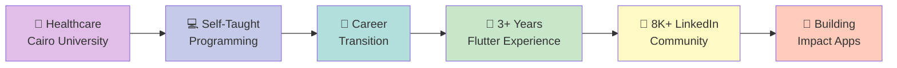

<div align="center">
  
<!-- Animated Header -->


<!-- Typing Animation Title -->


<!-- Tech Stack Badges -->
<p>
  
  
  
  
</p>

<!-- Profile Stats -->
<p>
  <a href="https://github.com/AserAbdo?tab=repositories">

  </a>
  <a href="https://www.linkedin.com/in/aser-abdel-ghaffar-/">
    
  </a>

</p>

<!-- Animated Divider -->


</div>

<br>

## 👨‍💻 About Me

```dart
class AserAbdelGhaffar {
  final String role = "Flutter Developer";
  final String education = "Cairo University Graduate 🎓";
  final int yearsOfExperience = 3;
  final String location = "Cairo, Egypt 🇪🇬";
  final String portfolio = "aserabdo.dev";
  
  List<String> currentRole = [
    "Flutter Developer at DeveloperXSoftware",
    "Building production-grade healthcare & delivery solutions",
    "Mentoring developers & sharing knowledge with 8K+ community",
  ];
  
  Map<String, List<String>> expertise = {
    "mobile": ["Flutter", "Dart", "Cross-Platform Development"],
    "architecture": ["Clean Architecture", "MVC", "SOLID Principles"],
    "stateManagement": ["GetX", "BLoC", "Riverpod", "Provider"],
    "backend": ["Firebase", "RESTful APIs", "Laravel Integration"],
    "deployment": ["Google Play", "App Store", "CI/CD Pipelines"],
    "integrations": [
      "GPS & Google Maps", 
      "Payment Gateways", 
      "WhatsApp API",
      "YouTube API", 
      "Lottie Animations"
    ],
  };
  
  String journey = """
    Self-taught developer who transitioned from healthcare to tech.
    Passionate about building scalable, user-focused mobile applications.
    Published multiple apps on Google Play serving real users.
  """;
  
  bool openToOpportunities = true;
  bool availableForCollaboration = true;
  
  void connect() {
    print("Let's build something amazing together! 🚀");
  }
}
```

### 🌟 Quick Highlights

<table>
<tr>
<td width="50%">

- 🔥 **3+ years** building production Flutter apps
- 📱 **30+ repositories** with diverse projects
- 🎓 **Self-taught** - healthcare to tech transition
- 👥 **8K+ LinkedIn followers** - active community builder

</td>
<td width="50%">

- 🚀 **Published apps** on Google Play
- 💼 **DeveloperXSoftware** - Current employer
- 🏆 **NTI Scholarship** - 90-hour intensive training
- 📚 **Multiple certifications** from Google, Microsoft, Meta

</td>
</tr>
</table>

<br>

## 💼 Professional Experience

<details>
<summary><b>🔹 Flutter Developer | DeveloperXSoftware</b></summary>
<br>

**Feb 2025 – Present** | Giza, Egypt

### 📱 Dura Smile App (Aug 2025 – Oct 2025)
Healthcare management system connecting clinics, labs, doctors, and drivers

**Tech Stack:** `Flutter` `Laravel REST API` `GetX` `Firebase`

**Key Features:**
- Multi-role system for clinics, labs, doctors, and drivers
- Integrated job order management and appointment scheduling
- Dynamic dashboard with real-time case status updates

**Impact:** Streamlined healthcare service coordination across multiple stakeholders

---

### 🚚 Hayat Delivery App (Apr 2025 – Jul 2025)
Multi-role delivery platform with tiered subscription plans

**Tech Stack:** `Flutter` `REST API` `BLoC` `Firebase` `GPS`

**Key Features:**
- Multi-role architecture: merchant and delivery driver flows
- Dynamic subscription management: Starter, Pro, Enterprise tiers
- Event-based real-time push notifications
- Live GPS tracking for delivery monitoring

**Impact:** Efficient order management system serving multiple user types

</details>

<details>
<summary><b>🔹 Flutter Developer | PST Egypt</b></summary>
<br>

**Sep 2022 – Feb 2025** | Remote

### 📚 Online Education Platform (Dec 2024 – Feb 2025)
Full-featured educational platform for students and teachers

**Tech Stack:** `Flutter` `Firebase` `Provider` `WhatsApp API`

**Key Features:**
- In-app wallet system for seamless transactions
- Admin dashboard for subscription management
- Real-time WhatsApp integration for communication
- Content delivery and course management system

**Impact:** Enabled remote learning with integrated payment solutions

---

### 🍔 eFood App (Sep 2024 – Dec 2024)
Multi-restaurant food ordering platform with live tracking

**Tech Stack:** `Flutter` `Firebase` `Google Maps API` `GetX`

**Key Features:**
- Multi-restaurant ordering in single transaction
- Real-time GPS delivery tracking
- In-app promotions and discount system
- Push notifications for order status updates

**Impact:** Enhanced food delivery experience with live tracking capabilities

---

### 🤖 Edu - AI Teacher Assist App (Jun 2023 – Present)
AI-powered teacher assistant for attendance and assessments

**Tech Stack:** `Flutter` `Firebase` `AI Integration`

**Key Features:**
- Automated attendance tracking system
- Quiz creation and management for students
- Real-time updates for attendance and results
- **✅ Published on Google Play Store**

**Impact:** Reduced administrative workload for teachers significantly

</details>

<details>
<summary><b>🔹 NTI Scholarship | Creativa Innovations Hub</b></summary>
<br>

**Nov 2025 – Jan 2026** | Giza Branch

- Completed intensive **90-hour technical training** in Flutter development
- Built multiple applications: BMI calculator, real-time chat app
- Implemented RESTful API integration and CRUD operations
- Mastered Firebase authentication and cloud storage integration

</details>

<br>

## 🛠️ Tech Stack & Tools

<table>
<tr>
<td width="50%" valign="top">

### 💙 Core Technologies


### 🏗️ Architecture & Design


### 🔧 State Management


### 🔥 Backend & APIs


</td>
<td width="50%" valign="top">

### 🚀 Deployment & DevOps


### 🎨 Development Tools


### 🔌 Integrations & APIs


### ⚙️ Version Control & Design


</td>
</tr>
</table>

<br>

## 🏆 Certifications & Continuous Learning

<table>
<tr>
<td width="50%" valign="top">

### 📜 Professional Certifications

✅ **Software Design Patterns** - Educative  
✅ **Generative AI** - Microsoft  
✅ **Project Management** - MTF Institute  
✅ **Principles of Clean Code** - MaharaTech  
✅ **IT Support Professional** - Google

</td>
<td width="50%" valign="top">

### 🎓 Technical Training & Courses

✅ **Flutter Clean Architecture** - Udemy  
✅ **Learning Dart & Flutter** - Google  
✅ **Git & GitHub Version Control** - Meta  
✅ **NTI Scholarship** - 90-hour intensive Flutter training  
✅ **Self-Taught Programming Journey** - Ongoing

</td>
</tr>
</table>

<br>

## 🎯 Featured Projects Portfolio

<table>
<tr>
<td width="50%" valign="top">

### 🏥 Healthcare Solutions
**Dura Smile** - Multi-role healthcare management system  
**Edu AI Teacher Assist** - Published on Google Play

### 🚚 Delivery & E-commerce
**Hayat Delivery** - Multi-tier subscription delivery platform  
**eFood** - Multi-restaurant ordering with GPS tracking

</td>
<td width="50%" valign="top">

### 📚 Education Technology
**Online Education Platform** - E-learning with integrated wallet  
**Chat Applications** - Real-time messaging systems

### 🧮 Utility Applications
**BMI Calculator** - Health tracking application  
**Custom CRUD Apps** - Firebase-powered applications

</td>
</tr>
</table>

> 📂 **30+ repositories** available on my GitHub profile - Feel free to explore!

<br>

## 💡 Current Focus & Goals

<table>
<tr>
<td width="50%" valign="top">

### 🔭 Currently Working On
- Building production apps at **DeveloperXSoftware**
- Developing **healthcare & delivery solutions**
- Learning **microservices architecture**
- Exploring **advanced Flutter animations**

</td>
<td width="50%" valign="top">

### 🎯 2026 Goals
- [ ] Publish 5+ apps on Google Play & App Store
- [ ] Contribute to major open-source projects
- [ ] Reach 10K+ LinkedIn followers
- [ ] Build and launch personal SaaS product
- [ ] Mentor 10+ junior developers

</td>
</tr>
</table>

<br>

## 🌟 Soft Skills & Professional Traits

<table>
<tr>
<td width="50%" valign="top">

### 💼 Technical Excellence
🎯 Problem Solving & Critical Thinking  
🔍 Attention to Detail  
📚 Continuous Learning Mindset  
🚀 Self-Motivated & Initiative-Driven

</td>
<td width="50%" valign="top">

### 🤝 Collaboration & Communication
👥 Team Collaboration  
🔄 Agile/Scrum Methodologies  
📢 Knowledge Sharing & Mentoring  
⏱️ Time Management & Adaptability

</td>
</tr>
</table>

<br>

## 🎓 My Unique Journey

<div align="center">



</div>

**Why This Matters:** My healthcare background provides unique insight into building user-focused applications. I understand user needs, attention to detail, and the critical importance of reliability in production systems.

<br>

## 📫 Let's Connect & Collaborate!

<div align="center">

[](https://aserabdo.dev)
[](https://www.linkedin.com/in/aser-abdel-ghaffar-/)
[](mailto:aserabdocontact@gmail.com)
[](https://github.com/AserAbdo)
[](https://www.facebook.com/Aser.Abdel.Ghaffar.Mohamed/)

<br>

💼 **Open to Opportunities** | 🤝 **Available for Collaboration** | 📱 **+20 114 885 5960**

</div>

<br>

## 📈 Contribution Activity

<div align="center">
  


</div>

<br>

## 💭 Developer Wisdom

<div align="center">
  


</div>

<br>

---

<div align="center">


### ⭐️ From [Aser Abdel Ghaffar](https://github.com/AserAbdo)

**Self-Taught Developer** 💪 | **Flutter Specialist** 💙 | **Building the Future** 🚀

*"From healthcare to code - Proving that passion and dedication can transform careers"*

**If you find my work valuable, consider giving my repositories a star ⭐**

</div>
